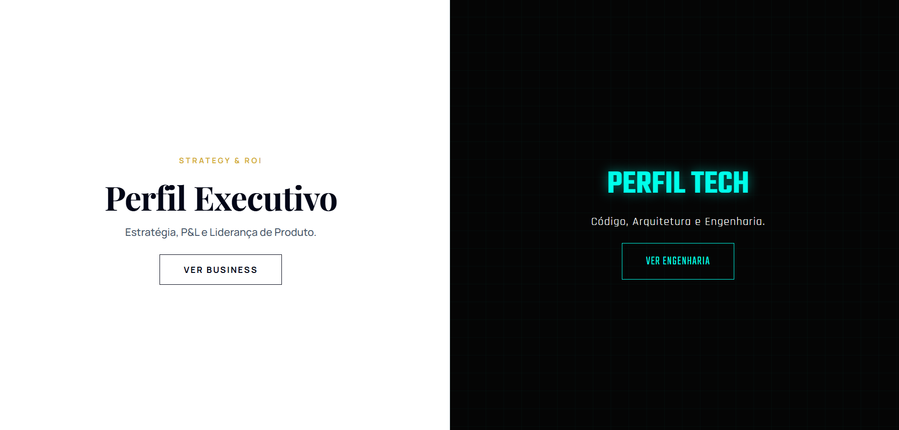

# 🌐 Jaqueline Daniel - Strategic Hub (Dual-Core Portfolio)

> **"A convergência entre Visão de Negócio (P&L) e Engenharia de Software."**



<div align="center">


</div>

---

## 🎯 Visão do Produto: Por que dois perfis?

No mercado atual, profissionais híbridos enfrentam um dilema de comunicação:
1.  **Recrutadores Executivos** buscam solidez, ROI e gestão.
2.  **Tech Leads** buscam código, criatividade e domínio técnico.

Como **Product Owner & Business Analyst**, tratei o meu portfólio como um Produto Digital. A solução foi desenvolver uma arquitetura **Dual-Core**: um único domínio que ramifica a experiência do usuário baseado na intenção do visitante.

### 🏛️ Modo Executivo (Navy & Gold)
* **Target:** C-Level, Heads de Produto, RH.
* **Foco:** Métricas de negócio, Unit Economics, Liderança e Casos de Sucesso (WinWin & InnovaBank focados em resultado).
* **Estética:** Minimalismo "Corporate Premium", tipografia serifada e layout focado em leitura e conversão.

### 💻 Modo Tech (Matrix/Cyberpunk)
* **Target:** Desenvolvedores, CTOs, Entusiastas.
* **Foco:** Stack tecnológica, Arquitetura de Software, JSON Resume e paixão pelo código.
* **Estética:** Terminal, Neon, Dark Mode e interações gamificadas.

---

## 🏗 Engenharia do Projeto (My Role)

Atuei como **Product Owner e Desenvolvedora Front-End**, orquestrando o ciclo completo:

### 1. UX/UI & Branding Dinâmico
* **Segmentação de Audiência:** Criação de uma "Landing Page de Escolha" ou navegação fluida que permite ao usuário alternar entre as personas sem atrito.
* **Psicologia das Cores:** Uso estratégico de **Azul Marinho/Dourado** para evocar autoridade financeira no perfil executivo, e **Preto/Neon** para evocar inovação no perfil técnico.

### 2. AI-Augmented Development (A Execução)
Este projeto utiliza uma abordagem moderna de prototipagem acelerada:
* **Lógica de Negócio:** Definição humana. Eu desenhei a estrutura, a narrativa e a arquitetura de informação.
* **Geração de Código:** Utilização de **Agentes de IA Generativa** para escrever a sintaxe repetitiva (HTML/CSS), permitindo-me focar 100% no refinamento da experiência e na estratégia de conteúdo.
* **Resultado:** Um produto entregue com velocidade de mercado, código limpo e foco total no usuário final.

---

## 🛠 Stack Tecnológica

| Camada | Tecnologia | Motivo da Decisão de Engenharia |
| :--- | :--- | :--- |
| **Core** | HTML5 Semântico | SEO, Acessibilidade e estrutura sólida. |
| **Estilização** | CSS3 / Tailwind Concepts | Design System modular para suportar dois temas visuais distintos no mesmo ecossistema. |
| **Lógica** | JavaScript (ES6+) | Manipulação de DOM para transição de temas e interatividade leve sem o "peso" de frameworks desnecessários para um site estático. |
| **Deploy** | GitHub Pages | Hospedagem estática de alta disponibilidade. |

---

## 🧩 Os Produtos no Portfólio (Cases)

O site apresenta dois produtos principais que demonstram a minha capacidade de entrega end-to-end:

### 🏆 [WinWin App (Gamificação Comportamental)](https://github.com/jaquelinedaniel-pt/WinWin)
* **Visão de PO:** Sistema de modificação comportamental e produtividade baseado em economia de tokens.
* **Tech:** React Native, Expo, Firebase.

### 🏦 [InnovaBank (Fintech Conversion)](https://github.com/jaquelinedaniel-pt/innovabank)
* **Visão de PO:** Estratégia de redução de CAC (Custo de Aquisição) através de design de confiança e simuladores financeiros.
* **Tech:** JS Vanilla, CSS Glassmorphism, Security Logic.

---

## 👩‍💻 Sobre a Autora

<table>
  <tr>
    <td align="center">
      <br />
      <sub><b>Jaqueline Daniel</b></sub>
    </td>
    <td>
      <strong>Product Owner | Business Strategist | Tech Enthusiast</strong><br>
      <i>"A tecnologia precisa de código, mas o sucesso de um produto depende de quem entende de pessoas e processos."</i><br><br>
      15 anos de experiência transformando complexidade operacional em produtos digitais de alto valor.<br><br>
      <a href="https://www.linkedin.com/in/jaquelinedaniel-pt/">
        
      </a>
      <a href="mailto:jaquelinedaniel.pt@gmail.com">
        
      </a>
    </td>
  </tr>
</table>

---

## 🚀 Como Rodar Localmente

```bash
# Clone o repositório estratégico
git clone [https://github.com/jaquelinedaniel-pt/meu-portfolio.git](https://github.com/jaquelinedaniel-pt/meu-portfolio.git)

# Acesse a pasta
cd meu-portfolio

# Abra o index.html
# A partir da Home, escolha: "Executivo" ou "Tech" e navegue entre os mundos.
